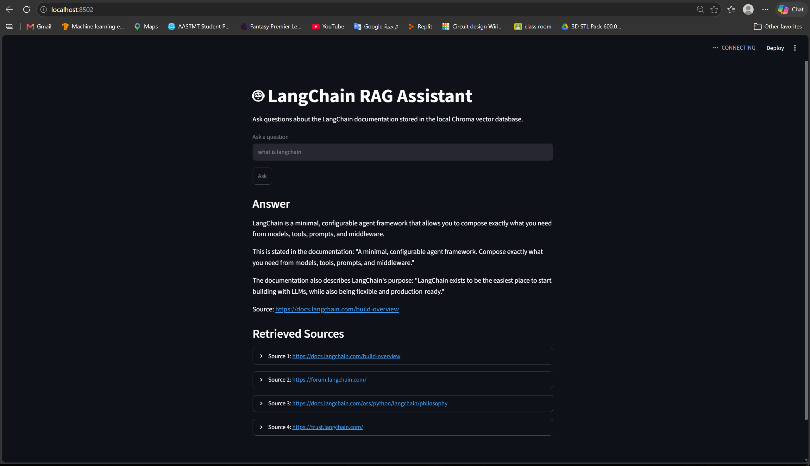

\# 🤖 LangChain Mini RAG


A local Retrieval-Augmented Generation application for querying

LangChain documentation.


\## 🖥️ Demo


The Streamlit interface allows users to ask questions about LangChain documentation.


The system retrieves relevant chunks from Chroma and uses Qwen3:4B to generate grounded answers.


<p align="center">

&#x20; 

</p>


\## Architecture


```text

LangChain Documentation

\&#x20;       ↓

Tavily Crawl

\&#x20;       ↓

LangChain Documents

\&#x20;       ↓

RecursiveCharacterTextSplitter

\&#x20;       ↓

nomic-embed-text

\&#x20;       ↓

Chroma Vector Database

\&#x20;       ↓

User Question

\&#x20;       ↓

Semantic Retrieval

\&#x20;       ↓

Top Relevant Chunks

\&#x20;       ↓

Qwen3:4B

\&#x20;       ↓

Answer

\&#x20;       ↓

Streamlit UI


